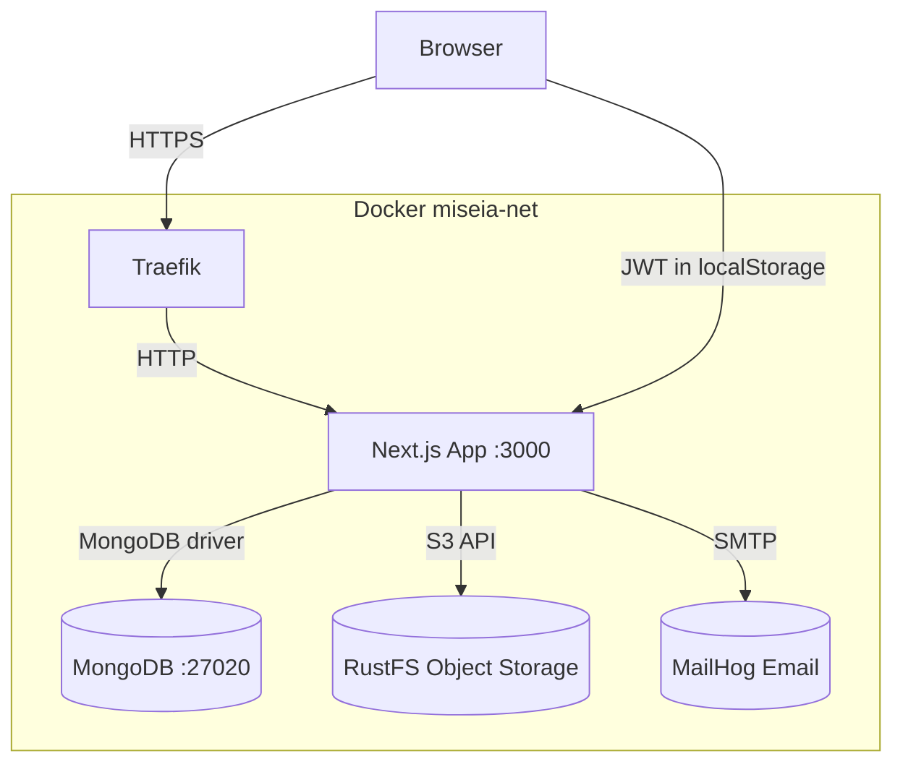

# BondVault — Corporate Bond Management Platform

A **Next.js 16 / TypeScript** full-stack web application for managing corporate debt bonds end-to-end: issuance structuring, investor order management (bookbuilding), automated coupon & principal payments, compliance reporting, and real-time investor portfolio tracking.

---

## Modules Implemented

### 1. Magic Link Authentication
Passwordless login via one-time email tokens. A signed JWT (RS-256, 7-day TTL) is issued on verification and stored in `localStorage`. All API routes validate the `Authorization: Bearer <token>` header server-side — no cookies, no sessions.

### 2. Bond Structuring (Admin)
Admins define bonds with face value, coupon rate (fixed or variable, stored in basis points), payment frequency, maturity date, credit rating, sector, and lifecycle status (`draft → offering → active → matured`). All monetary values are stored as **integer cents** to avoid floating-point drift.

### 3. Order Book / Bookbuilding (Admin)
Real-time demand tracking during the offering period. Investor orders are recorded with requested amount, quantity, and price per bond. Admins can monitor fill ratios and adjust final pricing.

### 4. Automated Payments (Admin)
Scheduled coupon and principal repayment events. Each payment record tracks type (`coupon | principal | early-redemption`), status (`scheduled → processing → completed | failed`), and a unique reference string for reconciliation.

### 5. Compliance & Reporting Portal (Admin)
Auto-generates tax documents, fund-usage reports, and covenant-compliance reports. Documents are stored in AWS S3-compatible storage (RustFS) and referenced via `s3Key` in MongoDB.

### 6. Bond Screener (Investor)
Advanced filters by credit rating, YTM, maturity date, and sector. Includes a full bond purchase flow that creates an `Order` and updates the investor's `Holding`.

### 7. Comprehensive Position Dashboard (Investor)
Real-time view of current market value of held bonds, upcoming coupon payments, and historical return calculations.

### 8. Alerts & Risk Analysis (Investor)
Notifications for issuer rating changes, price fluctuations, and portfolio rebalancing recommendations — categorized by severity (`info | warning | critical`).

### 9. Seed Script
`scripts/seed.ts` populates MongoDB with sample users, bonds, orders, payments, and alerts via `npm run seed`.

---

## Project Structure

```
bonus/
├── app/
│   ├── layout.tsx                  — Root layout with auth context provider
│   ├── page.tsx                    — Landing / home page
│   ├── login/page.tsx              — Magic link request form
│   ├── auth/verify/page.tsx        — Token verification & JWT storage
│   ├── admin/
│   │   ├── layout.tsx              — Admin shell (role guard)
│   │   ├── bonds/page.tsx          — Bond structuring UI
│   │   ├── orderbook/page.tsx      — Bookbuilding order book
│   │   ├── payments/page.tsx       — Payment scheduler & status
│   │   └── compliance/page.tsx     — Compliance document portal
│   ├── investor/
│   │   ├── layout.tsx              — Investor shell (role guard)
│   │   ├── screener/page.tsx       — Bond screener & purchase flow
│   │   ├── dashboard/page.tsx      — Position dashboard
│   │   └── alerts/page.tsx         — Risk alerts panel
│   └── api/
│       ├── auth/send/route.ts      — POST: generate & email magic link
│       ├── auth/verify/route.ts    — GET: verify token, issue JWT
│       ├── bonds/route.ts          — GET/POST bonds collection
│       ├── bonds/[id]/route.ts     — GET/PATCH/DELETE single bond
│       ├── orders/route.ts         — GET/POST investor orders
│       ├── payments/route.ts       — GET/POST payment schedule
│       ├── portfolio/route.ts      — GET investor holdings
│       ├── alerts/route.ts         — GET/PATCH investor alerts
│       └── compliance/route.ts     — GET/POST compliance documents
├── lib/
│   ├── db.ts                       — MongoDB singleton (native driver)
│   ├── types.ts                    — All TypeScript interfaces & enums
│   ├── auth.ts                     — JWT sign/verify, magic token generation
│   ├── auth-client.ts              — Client-side token helpers (localStorage)
│   ├── email.ts                    — Nodemailer / MailHog transport
│   └── payments.ts                 — Payment scheduling & processing logic
├── components/
│   └── ui/Navbar.tsx               — Shared navigation bar
├── next.config.ts                  — Next.js configuration
├── tsconfig.json                   — TypeScript compiler options
└── package.json                    — Dependencies & npm scripts
```

---

## Architecture



---

## Architecture Decisions

### Decision 1: JWT in localStorage vs. HttpOnly Cookies
- **Chose:** JWT stored in `localStorage`
- **Why:** The project spec explicitly forbids cookies. Magic-link auth sends one-time tokens by email; `localStorage` lets client-side JS forward the token in `Authorization: Bearer` headers for API calls without cookie-aware fetch wrappers.
- **Trade-off:** localStorage is vulnerable to XSS. Mitigated by strict CSP headers. HttpOnly cookies would prevent XSS token theft but require CSRF protection and complicate the SPA architecture.

### Decision 2: MongoDB native driver vs. Mongoose
- **Chose:** MongoDB native driver via `lib/db.ts` singleton
- **Why:** Mongoose's runtime schema validation duplicates TypeScript interfaces already defined in `lib/types.ts`. The native driver is lighter (~200 KB vs ~800 KB), provides direct access to aggregation pipelines for portfolio calculations, and avoids schema drift between runtime validators and compile-time types.
- **Trade-off:** No automatic schema enforcement at the driver level — correctness relies on TypeScript at compile time and input validation in API routes.

---

## AI-Assisted Development

Initial architecture skeleton (folder structure, TypeScript interfaces, auth flow) was generated with AI assistance. Notable changes made during review:

- **Coupon rate representation:** AI draft used floating-point percentages (`6.5`); changed to basis-point integers (`650`) to avoid floating-point drift in financial calculations.
- **Token storage:** AI draft used an in-memory Map for magic tokens; replaced with MongoDB TTL-indexed `magic_tokens` collection for persistence across restarts.
- **Error response shape:** Standardized all API error responses to `{ error: string }` with explicit HTTP status codes — AI draft mixed plain strings and objects inconsistently.

---

## Design Patterns / Architecture

| Pattern | Implementation |
|---|---|
| **Singleton** | `lib/db.ts` — one `MongoClient` instance shared across all server-side code via module-level caching |
| **Repository (implicit)** | API route handlers own all DB queries; server components call MongoDB directly without leaking connection logic |
| **Context / Provider** | Global React context in `app/layout.tsx` carries authenticated user state — no prop drilling across the component tree |
| **Token-based Auth** | Stateless JWT in `localStorage`; server validates `Authorization` header on every request — no session store needed |
| **Money-as-integers** | All monetary fields stored in cents (`number` integers); formatted to currency strings only at the display layer |
| **Role Guard** | Admin and investor layouts independently verify `role` from the decoded JWT before rendering children |

---

## How It Works

1. **Auth flow**: User enters their email → `/api/auth/send` stores a one-time token in MongoDB and emails a magic link via MailHog → clicking the link hits `/api/auth/verify`, which validates the token, issues a signed JWT, and redirects the browser to the correct dashboard (admin or investor).
2. **Data flow**: Server Components (admin/investor pages) fetch directly from MongoDB using the `lib/db.ts` singleton. Client Components (forms, filters, interactive tables) call the Next.js API routes with the stored JWT in the `Authorization` header.
3. **Payment lifecycle**: `lib/payments.ts` schedules coupon events based on bond `paymentFrequency` and `maturityDate`, persisting `Payment` documents that the admin payments page can trigger and track.

```ts
// Verifying a magic link and issuing a JWT (app/api/auth/verify/route.ts)
const record = await db.collection('magic_tokens').findOne({ token, used: false })
if (!record || record.expiresAt < new Date()) {
  return NextResponse.json({ error: 'Token expired or invalid' }, { status: 401 })
}
await db.collection('magic_tokens').updateOne({ _id: record._id }, { $set: { used: true } })
const jwtToken = signToken({ userId: user._id.toString(), email: user.email, role: user.role })
return NextResponse.json({ token: jwtToken, user })
```

---

## Getting Started

### Prerequisites
- Node.js 20+
- Docker (for MongoDB, MailHog, and RustFS)
- npm 10+

### Clone

```bash
git clone https://github.com/Jorgeaapaz/MISEIA_1-4-190-bonus.git
cd MISEIA_1-4-190-bonus
```

### Install dependencies

```bash
npm install
```

### Configure environment

Create a `.env.local` file at the project root:

```env
MONGODB_URI=mongodb://localhost:27017
MONGODB_DB=bonos_db

AWS_USERNAME=minioadmin
AWS_PASSWORD=minioadmin1234
AWS_REGION=us-east-1
AWS_URL=http://localhost:10000
AWS_BUCKET=bonos-bucket

MAILHOG_HOST=localhost
MAIL_PORT=1027

NEXT_PUBLIC_API_URL=http://localhost:3000
JWT_SECRET=magik-link-dev-secret-2026
```

### Start Docker services

```bash
# MongoDB, MailHog, RustFS (S3-compatible)
docker compose up -d
```

### Seed the database

```bash
npm run seed
```

### Run the development server

```bash
npm run dev
```

Open [http://localhost:3000](http://localhost:3000) in your browser. MailHog UI is available at [http://localhost:8025](http://localhost:8025).

### Run tests

```bash
# Unit tests
npm run test

# Unit tests with coverage report
npm run test:coverage

# End-to-end tests (requires app running on :3000)
npm run test:e2e
```

---

## Example Flows

### Success — Investor logs in and views their portfolio

1. Enter email at `/login` → magic link arrives in MailHog inbox
2. Click link → JWT stored, redirected to `/investor/dashboard`
3. Dashboard displays current holdings, upcoming coupon dates, and unrealized P&L

### Success — Admin creates a new bond

```
POST /api/bonds
Authorization: Bearer <admin-jwt>

{
  "bondName": "Serie A 2026",
  "companyName": "Energía Verde SA",
  "faceValue": 100000,        // $1,000.00 (cents)
  "couponRate": 650,          // 6.50% (basis points)
  "paymentFrequency": "quarterly",
  "maturityDate": "2031-06-01",
  "creditRating": "A",
  "sector": "energy"
}
→ 201 Created  { "_id": "...", "status": "draft", ... }
```

### Edge case — Expired or already-used magic link

```
GET /api/auth/verify?token=abc123
→ 401 Unauthorized  { "error": "Token expired or invalid" }
```

### Edge case — Non-admin attempts to access admin route

```
GET /api/bonds  (with investor JWT)
→ 403 Forbidden  { "error": "Insufficient permissions" }
```

---

## Production Deploy

The application is deployed at **https://bondvault.deviaaps.com** via GitHub Actions CI/CD to a GCP Ubuntu VM running Docker + Traefik.

See `.github/workflows/deploy.yml` for the full pipeline.
