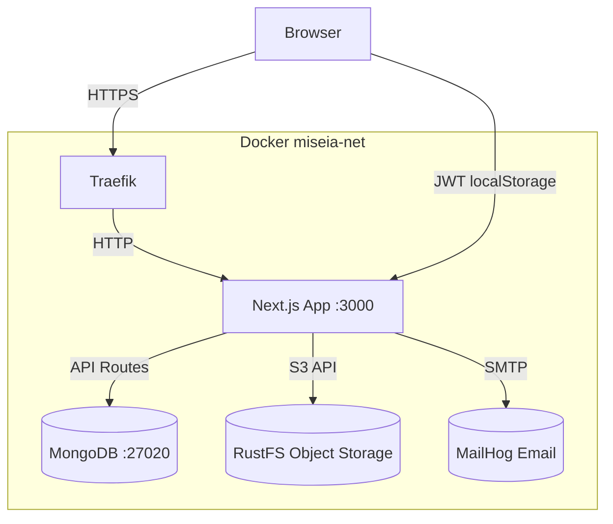

@~/.claude/prompts/new_functionality_prompt_spec.md

# Add .env.example, Architecture Diagram, and Documentation — BondVault

## Role
Act as a Senior Software Engineer and Technical Writer with expertise in Next.js projects.

## Context
Project root: `D:\Master-IA-Dev\04-Bloque4\1-4-190-bonus\bonus`

Missing documentation items:
1. `.env.example` — required by evaluacion-requirements.md (`dc_env_example`)
2. Architecture diagram in README — ASCII or Mermaid (`dc_diagrama_arquitectura`)
3. Trade-off decisions section in README (`dc_decisiones_documentadas`)
4. AI changes documentation section (`dc_cambios_ia_documentados`)
5. Test commands in README (`dc_comandos_verificacion`)
6. Deploy section in README (`dc_instrucciones_deploy`)

## Task

### 1. Create `.env.example`
Create `.env.example` at the project root with all required variables listed, **without real values**:

```env
# MongoDB
MONGODB_URI=mongodb://localhost:27017
MONGODB_DB=bonos_db

# AWS S3 / RustFS (S3-compatible object storage)
AWS_USERNAME=your_access_key
AWS_PASSWORD=your_secret_key
AWS_REGION=us-east-1
AWS_URL=http://localhost:10000
AWS_BUCKET=bonos-bucket

# Email (MailHog for dev, SMTP for prod)
MAILHOG_HOST=localhost
MAIL_PORT=1027

# Next.js
NEXT_PUBLIC_API_URL=http://localhost:3000

# JWT
JWT_SECRET=your-jwt-secret-min-32-chars
NODE_ENV=development
```

### 2. Add Architecture Diagram to README
Add a Mermaid diagram section to `README.md` under a new `## Architecture` heading:



### 3. Add Decisions Section to README
Add a `## Architecture Decisions` section documenting at least 2 real trade-offs:

**Decision 1: JWT in localStorage vs. HttpOnly Cookies**
- Chose: JWT stored in localStorage
- Why: The AGENTS.md spec explicitly forbids cookies. Magic link auth sends one-time tokens via email; localStorage gives client-side JS full access to forward the token in `Authorization: Bearer` headers for API calls without needing cookie-aware fetch wrappers.
- Trade-off: Vulnerable to XSS (mitigated by Content-Security-Policy headers); HttpOnly cookies would prevent XSS token theft but require CSRF protection and complicate the SPA architecture.

**Decision 2: MongoDB native driver vs. Mongoose**
- Chose: MongoDB native driver via `lib/db.ts` singleton
- Why: Mongoose adds a runtime schema validation layer that duplicates TypeScript interfaces already defined in `lib/types.ts`. The native driver is lighter (~200KB vs ~800KB), offers direct access to aggregation pipelines for portfolio calculations, and avoids schema drift between runtime validators and compile-time types.
- Trade-off: No automatic schema enforcement at the driver level — relies on TypeScript at compile time.

### 4. Add AI Changes Section to README
Add a `## AI-Assisted Development` section noting:
- Initial architecture skeleton (folder structure, type definitions) was AI-generated
- Changes made: Added basis-point representation for coupon rates (initial draft used floating-point percentages), switched from in-memory token storage to MongoDB TTL-indexed collection, replaced generic error responses with domain-specific error codes

### 5. Update README with Test and Deploy Commands
Add to the existing "Getting Started" section:
```bash
# Run unit tests
npm run test

# Run unit tests with coverage
npm run test:coverage

# Run E2E tests (requires app running)
npm run test:e2e
```

Add `## Production Deploy` section pointing to `docs/compliance/003_cicd_github_actions_fn_prompt.md` and the live URL `https://bondvault.deviaaps.com`.

## Output checklist and Guardrails
- [ ] `.env.example` created with no real credentials
- [ ] Mermaid diagram added to README
- [ ] Trade-off decisions section added (2+ real decisions)
- [ ] AI changes section added
- [ ] Test commands added to README
- [ ] Deploy section added to README with live URL
- [ ] `.env.example` is NOT in `.gitignore` (it should be committed)
- [ ] `.env.local` and `.env.production` remain in `.gitignore`
